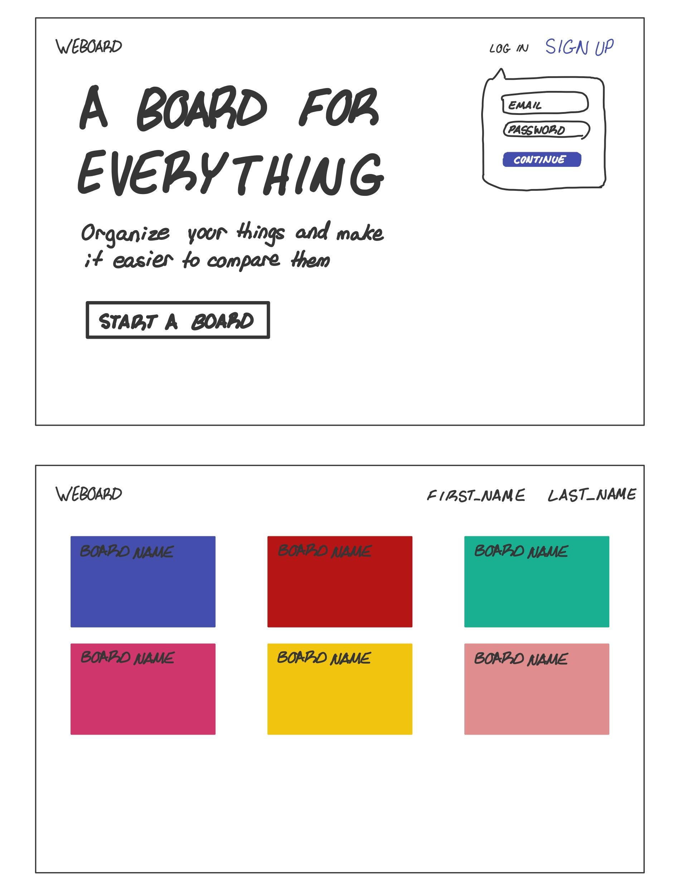

# Project 3: Design Journey

Be clear and concise in your writing. Bullets points are encouraged.

**Everything, including images, must be visible in VS Code's Markdown Preview.** If it's not visible in Markdown Preview, then we won't grade it.

# Design & Plan (Milestone 1)

## Describe your Gallery (Milestone 1)
> What will your gallery be about? 1 sentence.

A gallery of website design inspiration.

> Will you be using your existing Project 1 or Project 2 site for this project? If yes, which project?

N / A

> If using your existing Project 1 or Project 2, please upload sketches of your final design here.

N / A

## Target Audience(s) (Milestone 1)
> Tell us about your target audience(s).

Joe is a UI/UX designer and need inspiration for his website. He wants multible boards with pins that have images of the websites he finds inspiring

## Design Process (Milestone 1)
> Document your design process. Show us the evolution of your design from your first idea (sketch) to design you wish to implement (sketch). Show us the process you used to organize content and plan the navigation (card sorting), if applicable.
> Label all images. All labels must be visible in VS Code's Markdown Preview.
> Clearly label the final design.

# First Sketches:



# Final Sketches:


## Design Patterns (Milestone 1)
> Explain how your site leverages existing design patterns for image galleries.
> Identify the parts of your design that leverage existing design patterns and justify their usage.
> Most of your site should leverage existing patterns. If not, fully explain why your design is a special case (you need to have a very good reason here to receive full credit).

- User login
- Bookmarking for pins
- gallery view of all folders (in my case its boards)
- gallery view of all images (in my case its pins)
- pins can be opened for more information

## Requests (Milestone 1)
> Identify and plan each request you will support in your design.
> List each request that you will need (e.g. view image details, view gallery, etc.)
> For each request, specify the request type (GET or POST), how you will initiate the request: (form or query string param URL), and the HTTP parameters necessary for the request.

    Params with '!!' are not required

- Request: view all boards
  - Type: GET
  - Query String
  - Params: boards.name, boards.color

- Request: view all pins in board
  - Type: GET
  - Query String
  - Params: pins.name, pins.image_id, pins.link, pins.description

- Request: view pin in more detail
  - Type: GET
  - Query String
  - Params: pins.name, pins.image_id, pins.link, pins.description

- Request: view img
  - Type: GET
  - Query String
  - Params: img

- Request: view all stared pins
  - Type: GET
  - Query String
  - Params: stars.pin_id

- Request: view all stared boards
  - Type: GET
  - Query String
  - Params: stars.board_id

- Request: add pin
  - Type: POST
  - Form
  - Params: pins.name, pins.image_id, pins.price!!, pins.link, pins.description!!

- Request: delete pin
  - Type: POST
  - Form
  - Params: pins.id

- Request: add board
  - Type: POST
  - Form
  - Params: boards.name, boards.color

- Request: delete board
  - Type: POST
  - Form
  - Params: boards.id

- Request: add Image
  - Type: POST
  - Form
  - images.src, images.description

- Request: add Tag
  - Type: POST
  - Form
  - tags.pin_id, tags.name

- Request: add star
  - Type: POST
  - Form
  - Params: pins.id or boards.id (depends on what you want to star)

- Request: Search pins
  - Type: GET
  - Query String
  - Params: pins.name, pins.description

Example:
- Request: view movie details
  - Type: GET
  - Params: id _or_ movie_id (movies.id in DB)


## Database Schema Design (Milestone 1)
> Plan the structure of your database. You may use words or a picture.
> Make sure you include constraints for each field.

> Hint: You probably need `images`, `tags`, and `image_tags` tables.

> Hint: For foreign keys, use the singular name of the table + _id. For example: `image_id` and `tag_id` for the `image_tags` table.


Example:
```
users {
  id: INT PK NN U AI
  name: TEXT NN
  password: TEXT NN
}

boards {
  id: INT PK NN U AI
  user_id: INT NN
  name: TEXT NN
  color: TEXT NN DEFAULT #FFFFFF
}

pins {
  id: INT PK NN U AI
  board_id: INT NN
  name: TEXT NN
  image_id: INT NN
  link: TEXT NN
  description: TEXT
}

tags {
  id: INT PK NN U AI
  name: TEXT NN
  pin_id: INT NN
}

images {
  id: INT PK NN U AI
  src: TEXT NN
  size: TEXT NN
}

stars {
  id: INT PK NN U AI
  board_id: INT
  pin_id: INT
}

```

## New Plan

- removed users and stars
- added colors and dates

```

boards {
  id: INT PK NN U AI
  name: TXT NN
  color: TXT NN
  date: TXT NN
}

pin {
  id: INT PK NN U AI
  board_id INT NN
  image_id INT NN
  name: TXT NN
  link: TXT NN
  date: TXT NN
  description: TXT NN
}

image {
  id: INT PK NN U AI
  src: TXT NN
  description: TXT NN
}

tags {
  id: INT PK NN U AI
  pin_id: INT NN
  name: TXT NN
  color: TXT NN
}

```

## Database Query Plan (Milestone 1)
> Plan your database queries. You may use natural language, pseudocode, or SQL.
> Using your request plan above, plan all of the queries you need.

``` SQL
##All boards

SELECT * FROM boards LEFT OUTER JOIN stars ON pins.id = stars.board_id;;

##Stared boards

SELECT * FROM boards INNER JOIN stars ON pins.id = stars.board_id;

##All pins

SELECT tags.name, pins.name, pins.image_id, pins.link, pins.description, images.src, stars.pin_id FROM tags INNER JOIN pins ON tags.pin_id = pins.id INNER JOIN images ON pins.image_id = images.id LEFT OUTER JOIN stars ON pins.id = stars.pin_id;

##Stared Pins

SELECT tags.name, pins.name, pins.image_id, pins.link, pins.description, images.src, stars.pin_id FROM tags INNER JOIN pins ON tags.pin_id = pins.id INNER JOIN images ON pins.image_id = images.id INNER JOIN stars ON pins.id = stars.pin_id;

##Search by tag

SELECT tags.name, pins.name, pins.image_id, pins.link, pins.description, images.src, stars.pin_id FROM tags INNER JOIN pins ON tags.pin_id = pins.id WHERE tags.name LIKE '%param%' INNER JOIN images ON pins.image_id = images.id LEFT OUTER JOIN stars ON pins.id = stars.pin_id;

##Search by pin name

SELECT tags.name, pins.name, pins.image_id, pins.link, pins.description, images.src, stars.pin_id FROM tags INNER JOIN pins ON tags.pin_id = pins.id WHERE pins.name LIKE '%param%' INNER JOIN images ON pins.image_id = images.id LEFT OUTER JOIN stars ON pins.id = stars.pin_id;

##Search by pin description

SELECT tags.name, pins.name, pins.image_id, pins.link, pins.description, images.src, stars.pin_id FROM tags INNER JOIN pins ON tags.pin_id = pins.id WHERE pins.description LIKE '%param%' INNER JOIN images ON pins.image_id = images.id LEFT OUTER JOIN stars ON pins.id = stars.pin_id;

##Open pin for more info

SELECT tags.name, pins.name, pins.image_id, pins.link, pins.description, images.src, stars.pin_id FROM tags INNER JOIN pins ON tags.pin_id = pins.id WHERE pins.id = 'param' INNER JOIN images ON pins.image_id = images.id LEFT OUTER JOIN stars ON pins.id = stars.pin_id;

##Add Star to board/pin

INSERT INTO stars (pin_id) VALUES ('param');

INSERT INTO stars (board_id) VALUES ('param');

##Add Board

INSERT INTO boards (name, color) VALUES (':name', ':color')

##Add Pin

INSERT INTO images (src, size) VALUES (':src', ':size')

':image_id' = SELECT id FROM images ORDER BY id DESC LIMIT 1;

INSERT INTO pins (name, image_id, link, description) VALUES (':name', ':image_id', ':link', ':descpription')

':pin_id' = SELECT id FROM pins ORDER BY id DESC LIMIT 1;

INSERT INTO tags (name, pin_id) VALUES (':name', ':pin_id')

##Add Tag

INSERT INTO tags (name, pin_id) VALUES (':name', ':pin_id')
```


## New Plan

### Board

SELECT * FROM boards
SELECT * FROM boards WHERE id = :id

INSERT INTO boards Values (:name, :color, :date)
UPDATE boards SET name color date WHERE id = :id
DELETE FROM board WHERE id = :id

### pin

SELECT * FROM pins
SELECT * FROM pins WHERE id = :id
//for all pins
SELECT pins.id, pins.name, pins.link, pins.date, images.src, images.description FROM pins INNER JOIN images ON pins.image_id = images.id WHERE pins.board_id = :board_id
//for specific tag
SELECT tags.name, tags.color, pins.name, pins.image_id, pins.link, pins.date, images.src, images.description FROM tags INNER JOIN pins ON tags.pin_id = pins.id INNER JOIN images ON pins.image_id = images.id WHERE pins.board_id = :board_id AND tags.name like :name

INSERT INTO pins Values (:board_id :img_id :name, :link, :date :description)
UPDATE pins SET img_id name link date description date WHERE id = :id
DELETE FROM pins WHERE id = :id

### tags

SELECT tags.name, tags.color FROM tags WHERE tags.pin_id = :id

INSERT INTO tags Values (:name :color)
UPDATE tags SET name color WHERE id = :id
DELETE FROM tags WHERE id = :id

### Image

INSERT INTO images Values (:src, :desc)
UPDATE images SET src desc WHERE id = :id
DELETE FROM images WHERE id = :id


## Code Planning (Milestone 1)
> Plan what top level PHP pages you'll need.

- init.php
- search.php
- insert.php

## New Plan

- add board
- update board
- delete board
- add pin
- update pin
- delete pin
- init.php


> Plan what partials you'll need.

```
function for board card (board card info) {
  html code with board info
}

function for pin card (pin card info) {
  html code with pin info
}

function for expanded pin (pin card info) {
  html code with pin info
}
```

## New Plan

- remove the expanded pin function, don't need it
- expanded pin, or pin_close.php will be its own html page

function board card (board card info) {
  stuff I need:
  - preview of pin board
  - folder color
  - board name
  - date created
  - options menu for deleting and editing
}

function pin card (pin card info) {
  stuff I need:
  - scrrenshot of website (my image)
  - pin name
  - list of tags
  - link to the website
  - date created
  - options menu for deleting and editing
}

pin_close.php (expanded pin)
- stuff I need:
  - scrrenshot of website (my image)
  - pin name
  - list of tags
  - link to the website
  - date created
  - NEW!!! Description of pin
  - options menu for deleting and editing


> Plan any PHP code you'll need.

Example:
```PHP

##insert.php

if (insert pin) {
  'INSERT INTO images (src, size) VALUES (:src, :size)';

  $image_id = 'SELECT id FROM images ORDER BY id DESC LIMIT 1;';

  'INSERT INTO pins (name, image_id, link, description) VALUES (:name, :image_id, :link, :descpription)', array([':image_id'] => $image_id)

  $pin_id = 'SELECT id FROM pins ORDER BY id DESC LIMIT 1;';

  'INSERT INTO tags (name, pin_id) VALUES (:name, :pin_id)', array([':pin_id'] => $pin_id);
};

if (insert board) {
  'INSERT INTO boards (name, color) VALUES (:name, :color)', array([':name'] => $name, [':color'] => $color);
};

if (insert tag) {
  'INSERT INTO tags (name, pin_id) VALUES (:name, :pin_id)', array([':name'] => $name, [':pin_id'] => $pin_id);
};

```

## New plan

init.php
```php
  //just open the db
  //thats it
  $db = open_or_init_sqlite_db('secure/gallery.sqlite', 'secure/init.sql');
```

board_add.php
```php

// validate name

if valid {
  // insert into boards :info
}
```

board_update.php
```php

// validate name

if valid {
  // update board :values
}
```

board_delete.php
```php

// delete board where id = :id

```

pin_add.php
```php

// validate input

// get tags
explode('#', tags)
foreach (tag) {
  tag = explode(' ', tag)
  // tag[0] = name ; tag[1] = color
  tag[0] = filter_var(tag[0], filter_string)
}

// validate name
// validate link
// validate description
// validate that screenshot is actually an image

if (valid) {
  // filter all inputs
  // insert them into db
  "INSERT INTO images VALUES //all the image stuff"
  "SELECT id FROM images ORDER BY id DESC LIMIT 1" // the last one
  move_uploaded_file(img, to 'id.extention')
  "INSERT INTO pin VALUES //and all the stuff including the latest image id"
  foreach (tag) {
    "INSERT INTO tag"
  }
}

```

pin_update.php

```php

// validate input like pin_add

if (valid) {
  // update all info
  // sql for update


  // unlink image
  // upload new image
}
```

pin_delete.php

```php

// select image_id from pin
// sql DELETE pin
// sql DELETE tags where pin_id = :pin_id
// unlink image

```


# Complete & Polished Website (Final Submission)

## Gallery Step-by-Step Instructions (Final Submission)
> Write step-by-step instructions for the graders.
> For each set of instructions, assume the grader is starting from index.php.

Viewing all pins in a board (Viewing all galleries):
1. Get started by pressing 'Make a Board' on the main page
2. You will see a grid layout of 'Boards'
3. Click on a board to see the 'pins' in the board
Note: The boards are my galleries
Note2: There are some secrets in the main page

Make a new board (Add a gallery):
1. Click on the plus icon in the boards page
2. Put in a name and hit 'add board'
Note: There are some secrets in the board form

Edit a board (Edit a gallery):
1. Go to desired board card and hit the three dots
2. Click the 'edit' option
3. Input desired information and click done
Note: There are some secrets in the board form

Delete a board (Delete gallery):
1. Go to desired board card
2. Click on the three dots
3. Click the 'delete' option
4. Click the Check icon

View pins in your board (Viewing all images in your gallery):
1. Go to desired board card
2. Click on the image or the name of the board

View all pins for a tag (View all images for a tag):
1. Go to desired pin by
    - hovering over one of the tags at the top of the page
    - hovering over one of the tags in your desired pin
2. Click on the tag

View a single pin and all the tags for that pin(View a single image and all the tags for that image):
1. Go to desired pin
2. Click on the name or the image
3. You will be directed to a page with your pin's information

How to upload a new pin (How to upload a new image):
1. Go to the pins page
2. Click on the plus icon
3. Fill in the desired information
    - The image, the name, and the url are required
    - Tags must start with a '#' and you must press 'space' or 'enter' to register the pin
4. Click 'add pin' when you're done

How to delete a pin(How to delete an image):
1. Go to desired pin
2. Click on the three dots
3. Click on the 'delete' option
4. Click on the checkmark

How to view all tags at once:
1. Load your desired board
2. You will see a list of tags at the top of the page

How to edit a pin (How to add a tag to an existing image):
1. Go to desired pin
2. Click on the three dots
3. Click on the 'edit' option
4. Fill in desired information
Note: For inserting tags
- The tag must start with a hashtag
- The user must click 'space' or 'enter' to register the tag

Continuation on the tag input (How to remove a tag from an existing image):
- For the add pin form or for the edit pin form
- To delete
  - press 'delete'
  - tag will be highlighted by a red border
  - press 'delete' one more time
  - this will delete the tag


## Reflection (Final Submission)
> Take this time to reflect on what you learned during this assignment. How have you improved since starting this class?

I believe I learned a lot from this project and through my class experience. I started the class with almost no knowledge of html, php, css, or javascript, and I ended it with a very large proficiency in all of them. I also never expected to do such large scale database projects like this one. Last project, I started doing two table handleing and then I realised that I could only use 1 table. Ooops! So I already had some experience with multiple tables.
This project I had some trouble handleing how to return to the desired board page after a form submission. I was using url parameters to GET the board id, so when I POSTed I lost all the variables. I found I could change the header of the page after all my php form validation and sql stuff. GREAT! This let me go to the desired page after form submission. I hid the necessary url parameters in the form's submit value.
I really like how this project turned out visually also, it's clean yet friendly. I personally really like the options menu I have.
I think I did a really good job in this project. I am very proud of myself.

ALSO:
There are some secrets in the website :)
