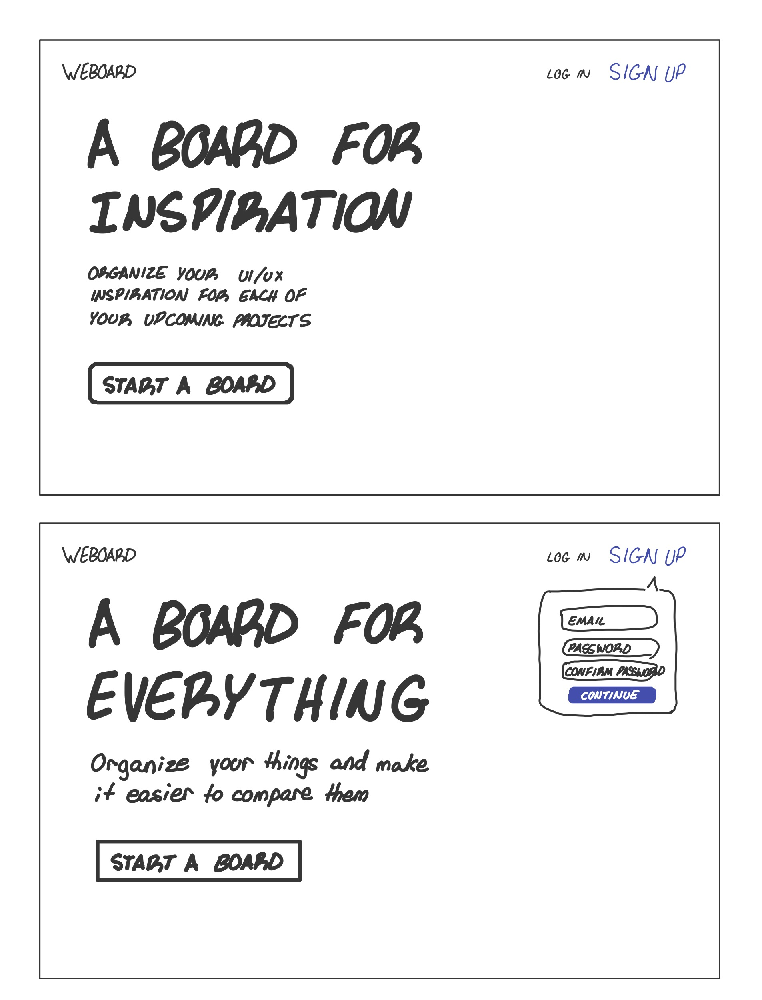
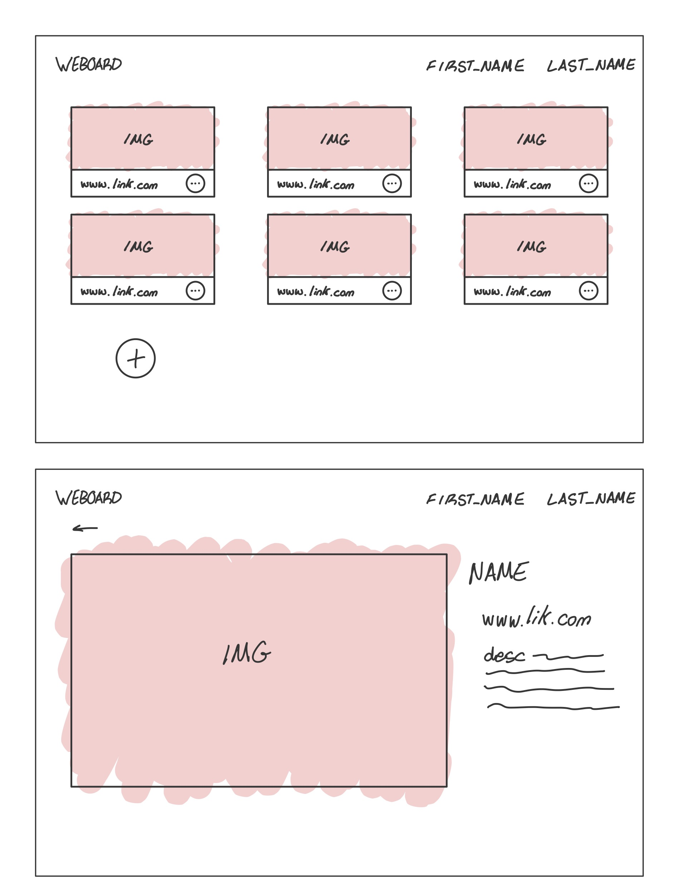
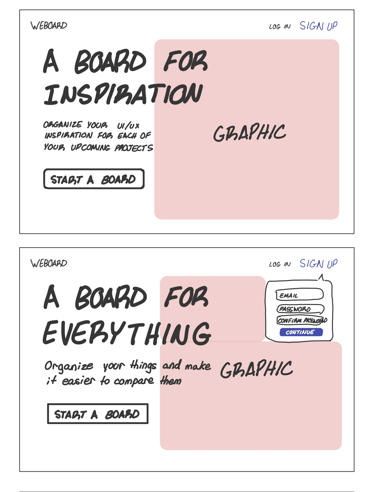

# Project 3: Design Journey

Be clear and concise in your writing. Bullets points are encouraged.

**Everything, including images, must be visible in VS Code's Markdown Preview.** If it's not visible in Markdown Preview, then we won't grade it.

# Design & Plan (Milestone 1)

## Describe your Gallery (Milestone 1)
> What will your gallery be about? 1 sentence.

A gallery of website design inspiration.

> Will you be using your existing Project 1 or Project 2 site for this project? If yes, which project?

N / A

> If using your existing Project 1 or Project 2, please upload sketches of your final design here.

N / A

## Target Audience(s) (Milestone 1)
> Tell us about your target audience(s).

Joe is a UI/UX designer and need inspiration for his website. He wants multible boards with pins that have images of the websites he finds inspiring

## Design Process (Milestone 1)
> Document your design process. Show us the evolution of your design from your first idea (sketch) to design you wish to implement (sketch). Show us the process you used to organize content and plan the navigation (card sorting), if applicable.
> Label all images. All labels must be visible in VS Code's Markdown Preview.
> Clearly label the final design.

# First Sketches:



# Final Sketches:



## Design Patterns (Milestone 1)
> Explain how your site leverages existing design patterns for image galleries.
> Identify the parts of your design that leverage existing design patterns and justify their usage.
> Most of your site should leverage existing patterns. If not, fully explain why your design is a special case (you need to have a very good reason here to receive full credit).

- User login
- Bookmarking for pins
- gallery view of all folders (in my case its boards)
- gallery view of all images (in my case its pins)
- pins can be opened for more information

## Requests (Milestone 1)
> Identify and plan each request you will support in your design.
> List each request that you will need (e.g. view image details, view gallery, etc.)
> For each request, specify the request type (GET or POST), how you will initiate the request: (form or query string param URL), and the HTTP parameters necessary for the request.

    Params with '!!' are not required

- Request: view all boards
  - Type: GET
  - Query String
  - Params: boards.name, boards.color

- Request: view all pins in board
  - Type: GET
  - Query String
  - Params: pins.name, pins.image_id, pins.link, pins.description

- Request: view pin in more detail
  - Type: GET
  - Query String
  - Params: pins.name, pins.image_id, pins.link, pins.description

- Request: view img
  - Type: GET
  - Query String
  - Params: img

- Request: view all stared pins
  - Type: GET
  - Query String
  - Params: stars.pin_id

- Request: view all stared boards
  - Type: GET
  - Query String
  - Params: stars.board_id

- Request: add pin
  - Type: POST
  - Form
  - Params: pins.name, pins.image_id, pins.price!!, pins.link, pins.description!!

- Request: delete pin
  - Type: POST
  - Form
  - Params: pins.id

- Request: add board
  - Type: POST
  - Form
  - Params: boards.name, boards.color

- Request: delete board
  - Type: POST
  - Form
  - Params: boards.id

- Request: add Image
  - Type: POST
  - Form
  - images.src, images.description

- Request: add Tag
  - Type: POST
  - Form
  - tags.pin_id, tags.name

- Request: add star
  - Type: POST
  - Form
  - Params: pins.id or boards.id (depends on what you want to star)

- Request: Search pins
  - Type: GET
  - Query String
  - Params: pins.name, pins.description

Example:
- Request: view movie details
  - Type: GET
  - Params: id _or_ movie_id (movies.id in DB)


## Database Schema Design (Milestone 1)
> Plan the structure of your database. You may use words or a picture.
> Make sure you include constraints for each field.

> Hint: You probably need `images`, `tags`, and `image_tags` tables.

> Hint: For foreign keys, use the singular name of the table + _id. For example: `image_id` and `tag_id` for the `image_tags` table.


Example:
```
users {
  id: INT PK NN U AI
  name: TEXT NN
  password: TEXT NN
}

boards {
  id: INT PK NN U AI
  user_id: INT NN
  name: TEXT NN
  color: TEXT NN DEFAULT #FFFFFF
}

pins {
  id: INT PK NN U AI
  board_id: INT NN
  name: TEXT NN
  image_id: INT NN
  link: TEXT NN
  description: TEXT
}

tags {
  id: INT PK NN U AI
  name: TEXT NN
  pin_id: INT NN
}

images {
  id: INT PK NN U AI
  src: TEXT NN
  size: TEXT NN
}

stars {
  id: INT PK NN U AI
  board_id: INT
  pin_id: INT
}

```

## Database Query Plan (Milestone 1)
> Plan your database queries. You may use natural language, pseudocode, or SQL.
> Using your request plan above, plan all of the queries you need.

``` SQL
##All boards

SELECT * FROM boards LEFT OUTER JOIN stars ON pins.id = stars.board_id;;

##Stared boards

SELECT * FROM boards INNER JOIN stars ON pins.id = stars.board_id;

##All pins

SELECT tags.name, pins.name, pins.image_id, pins.link, pins.description, images.src, stars.pin_id FROM tags INNER JOIN pins ON tags.pin_id = pins.id INNER JOIN images ON pins.image_id = images.id LEFT OUTER JOIN stars ON pins.id = stars.pin_id;

##Stared Pins

SELECT tags.name, pins.name, pins.image_id, pins.link, pins.description, images.src, stars.pin_id FROM tags INNER JOIN pins ON tags.pin_id = pins.id INNER JOIN images ON pins.image_id = images.id INNER JOIN stars ON pins.id = stars.pin_id;

##Search by tag

SELECT tags.name, pins.name, pins.image_id, pins.link, pins.description, images.src, stars.pin_id FROM tags INNER JOIN pins ON tags.pin_id = pins.id WHERE tags.name LIKE '%param%' INNER JOIN images ON pins.image_id = images.id LEFT OUTER JOIN stars ON pins.id = stars.pin_id;

##Search by pin name

SELECT tags.name, pins.name, pins.image_id, pins.link, pins.description, images.src, stars.pin_id FROM tags INNER JOIN pins ON tags.pin_id = pins.id WHERE pins.name LIKE '%param%' INNER JOIN images ON pins.image_id = images.id LEFT OUTER JOIN stars ON pins.id = stars.pin_id;

##Search by pin description

SELECT tags.name, pins.name, pins.image_id, pins.link, pins.description, images.src, stars.pin_id FROM tags INNER JOIN pins ON tags.pin_id = pins.id WHERE pins.description LIKE '%param%' INNER JOIN images ON pins.image_id = images.id LEFT OUTER JOIN stars ON pins.id = stars.pin_id;

##Open pin for more info

SELECT tags.name, pins.name, pins.image_id, pins.link, pins.description, images.src, stars.pin_id FROM tags INNER JOIN pins ON tags.pin_id = pins.id WHERE pins.id = 'param' INNER JOIN images ON pins.image_id = images.id LEFT OUTER JOIN stars ON pins.id = stars.pin_id;

##Add Star to board/pin

INSERT INTO stars (pin_id) VALUES ('param');

INSERT INTO stars (board_id) VALUES ('param');

##Add Board

INSERT INTO boards (name, color) VALUES (':name', ':color')

##Add Pin

INSERT INTO images (src, size) VALUES (':src', ':size')

':image_id' = SELECT id FROM images ORDER BY id DESC LIMIT 1;

INSERT INTO pins (name, image_id, link, description) VALUES (':name', ':image_id', ':link', ':descpription')

':pin_id' = SELECT id FROM pins ORDER BY id DESC LIMIT 1;

INSERT INTO tags (name, pin_id) VALUES (':name', ':pin_id')

##Add Tag

INSERT INTO tags (name, pin_id) VALUES (':name', ':pin_id')
```


## Code Planning (Milestone 1)
> Plan what top level PHP pages you'll need.

- init.php
- search.php
- insert.php

> Plan what partials you'll need.

```
function for board card (board card info) {
  html code with board info
}

function for pin card (pin card info) {
  html code with pin info
}

function for expanded pin (pin card info) {
  html code with pin info
}
```

> Plan any PHP code you'll need.

Example:
```PHP

##insert.php

if (insert pin) {
  'INSERT INTO images (src, size) VALUES (:src, :size)';

  $image_id = 'SELECT id FROM images ORDER BY id DESC LIMIT 1;';

  'INSERT INTO pins (name, image_id, link, description) VALUES (:name, :image_id, :link, :descpription)', array([':image_id'] => $image_id)

  $pin_id = 'SELECT id FROM pins ORDER BY id DESC LIMIT 1;';

  'INSERT INTO tags (name, pin_id) VALUES (:name, :pin_id)', array([':pin_id'] => $pin_id);
};

if (insert board) {
  'INSERT INTO boards (name, color) VALUES (:name, :color)', array([':name'] => $name, [':color'] => $color);
};

if (insert tag) {
  'INSERT INTO tags (name, pin_id) VALUES (:name, :pin_id)', array([':name'] => $name, [':pin_id'] => $pin_id);
};

```


# Complete & Polished Website (Final Submission)

## Gallery Step-by-Step Instructions (Final Submission)
> Write step-by-step instructions for the graders.
> For each set of instructions, assume the grader is starting from index.php.

Viewing all images in your gallery:
1.
2.

View all images for a tag:
1.
2.

View a single image and all the tags for that image:
1.
2.

How to upload a new image:
1.
2.

How to delete an image:
1.
2.

How to view all tags at once:
1.
2.

How to add a tag to an existing image:
1.
2.

How to remove a tag from an existing image:
1.
2.


## Reflection (Final Submission)
> Take this time to reflect on what you learned during this assignment. How have you improved since starting this class?
